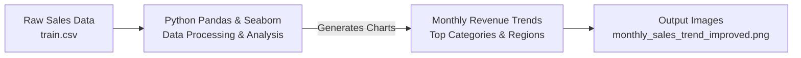

# Sales Analysis Project

A comprehensive sales data analysis project built with Python to extract insights on revenue trends, category and regional performance, and shipping efficiency.

## 📋 Project Overview

This project demonstrates an end-to-end sales analysis workflow:

1. Extracts sales data from a CSV dataset.

2. Transforms it using Pandas for cleaning, feature engineering, and calculation of delivery times and profit margins.

3. Analyzes revenue trends, category and sub-category performance, regional performance, and shipping efficiency.

4. Visualizes insights with Matplotlib and Seaborn in clear, professional charts.

# 🏗️ Architecture

## ⚙️ Technologies Used

* Language: Python 3.x

* Data Processing: Pandas

* Visualization: Matplotlib, Seaborn

* Data Analysis Concepts: Revenue Trends, Profit Margin, Delivery Time, Category & Regional Analysis

## 📁 Project Structure
```
sales-analysis-project/
├── sales_analysis.py          # Main Python script for analysis
├── train.csv                  # Sales dataset
├── monthly_sales_trend_improved.png  # Output chart  
└── README.md
```

## 🚀 How to Run
### Prerequisites

* Python 3.x installed on your machine.

* Required Python libraries: Pandas, Matplotlib, Seaborn.

1. Install Dependencies

        pip install pandas matplotlib seaborn

3. Ensure Dataset Availability

        Place the train.csv file in the same directory as sales_analysis.py or adjust the path in the script.

4. Run the Analysis
   
        python sales_analysis.py

5. View Results

The script generates a line chart showing monthly revenue trends and saves it as:


## 📊 Results

* Monthly Revenue Trends: Shows revenue for each month with peak points highlighted and values displayed.

* Top 5 Sub-Categories: Identifies best-selling products.

* Regional Performance: Highlights revenue contribution by region and city.

* Shipping Efficiency: Calculates average delivery time by shipping method.

* Profit Margin Estimation: Evaluates business efficiency assuming a 20% profit margin.
